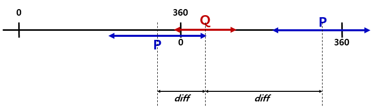
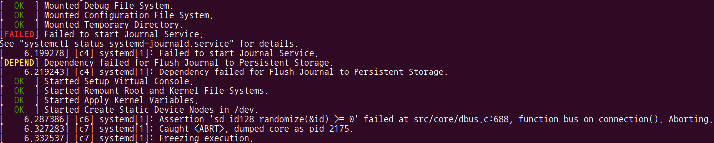
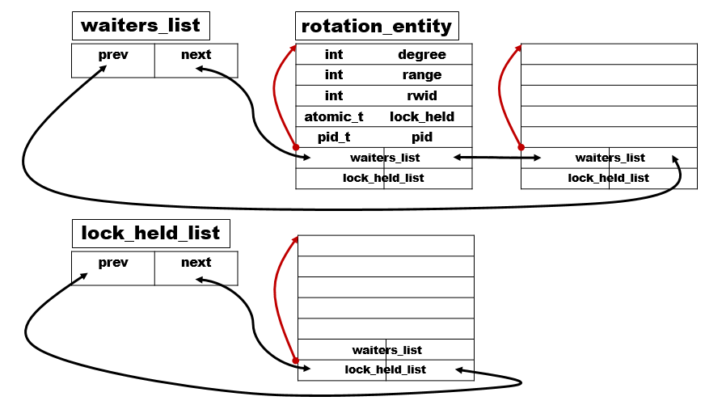
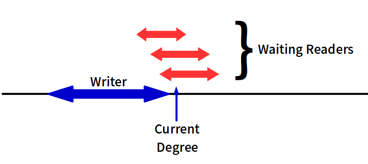
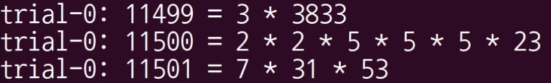

Proj3; Extend the deadline by *ONE DAY* using Bonus Day
===================

### Summary

Implement a new kernel synchronization primitive which provides reader writer lock based on device rotation


#### If you want to see a more detailed explanation of the changed code, please note the **easy-to-understand comment**


## Clarification

* **Degree and Range**

	New kernel primitive provides reader writer lock based on device rotation. As it is, three dimensional device orientation information(azimuth, inclination, etc.) can be detected via sensor device. Even if we use fake one dimensional rotation, degree is a continuous value, as well.

	For example, when degree of P is 330 and range of P is 60, P expresses union of [270, 360) and [0, 30]. When degree of Q is 30, and range of Q is 40, Q covers union of [350, 360) and [0, 70]. Degree is a continuous value as if it traverses a part of the circle, like a picture below.

	

	This concept is applied when determining whether given two ranges are overlapping or not in function `is_overlapped` First, calculate the absolute value of difference of given two degrees. In this case, *diff* is 300. Second, if *diff* is greater then 180, set *360-diff* as new *diff* value, because degree is a continuous value. In this case, revised *diff* is 60. Third, compare *diff* with the sum of given two ranges, if *diff* is greater than the sum of two ranges, given two intervals are not overlapping. In this case, sum of given two ranges is 100, thus P and Q are overlapping.


* **System Call Number**

	When `sys_rotunlock_write` system call number was 384, dependency error occurred during the boot process.

	

	To resolve this error, we assigned `sys_rotunlock_write` to **385**, and leave 384 with `sys_ni_syscall`. We do not know about the exact cause of this problem, but we think there might be something in the address of `__NR_SYSCALL_BASE+384` with pre-defined one, so it seems to cause a conflict with that.


* **integer file location**

	According to spec document, test program selector and trial writes and reads from a file called integer in the current working directory. **We assumed that the integer file is in a fixed location, in the `root` directory.** Following sentence can be found in both `selector.c` and `trial.c`.


	```
	#define FILENAME "/root/integer"
	```


## Implementation

### 1. Data Structures

* **rotation_entity**

	Struct `rotation_entity` has two embedded `list_head` called `waiters_list` and `lock_held_list`. `waiters_list` consists of readers and writers, waiting for holding locks. `lock_held_list` consists of readers and writers who have acquired locks already. Using some nice functions such as `list_for_each_entry` and `list_for_each_safe` defined in `linux/list.h`, we can traverse the list of processes conveniently. `rotation_entity` is managed as below.

	

	Once `rotation_entity` is created, it is added to the tail of `waiters_list` If the condition that a reader of writer can acquire a lock, that entity is removed from `waiters_list`, and added to the tail of `lock_held_list`. The offset between members in the structure is fixed at compile time. Thanks to the macro `container_of`, it is possible to backtrack the starting address of `rotation_entity` while traversing `list_head`, as indicated by the red arrow in the presented figure.

	To verify the validity of the attempt to unlock, `rotation_entity` has `pid` member. A process cannot release other processes' acquired lock. This constraint must also be satisfied for threads. Since processes and threads are managed as task struct, we identifies the validity of unlocking using `pid`.

	`rwid` member indicates whether given entity is a reader or a writer. We defined constant `READER` as 0, `WRITER` as 1, as an argument that can be assigned to `rwid`. To avoid situations that require mutual exclusion every time switching whether an entity is holding a lock or not, we used `atomic_t` type for `lock_held`. If given entity is currently holding a lock, then `lock_held` is 1. It is possible to use `atomic_read` and `atomic_set` to read and write `atomic_t` type, what can be said that the access is guaranteed to be atomic.
		 

* **wait_queue_head_t**

	If a process wants to grab a lock for a range which does not cover the current device rotation, the process should block until the process can grab a lock. Depending on whether the condition is met, the process should wake up or sleep at the appropriate time. In order to manage this, we use `wait_queue_head_t`. `wait_queue_head_t` points to the head of `wait_queue_t`, and it should be initialized before the use. First, our wait queue named `rotation_entity_wait_queue` is initializaed using `DECLARE_WAIT_QUEUE_HEAD` macro as below.


	```
	static DECLARE_WAIT_QUEUE_HEAD(rotation_entity_wait_queue);
	```

	In an attempt to grab a lock, before the every attempt, define `wait` whose type is `wait_queue`, using `DEFINE_WAIT` macro. If the attempt to grab a lock failed, register `wait` to our `rotation_entity_wait_queue`, using `add_wait_queue` function. `wait` sleeps until the condition is met, and it calls `scheduler`, and it resumes other process.


	```
	add_wait_queue(&rotation_entity_wait_queue, &wait);
	while(CONDITION) {
		prepare_to_wait(&rotation_entity_wait_queue, &wait, TASK_INTERRUPTIBLE);
		schedule(); 
	}
	finish_wait(&rotation_entity_wait_queue, &wait);
	```

	When the condition is satisfied at a certain point and when spinning must come to an end, `wake_up` function is called in `assign_locks_proxy`. `wake_up` function wakes up all of process in the `rotation_entity_wait_queue`. However, thundering herd problem does not occur, because it checks whether the condition value is still satisfied, and decides whether to keep sleeping or not to sleep. If the condition is met, finally it is removed from `rotation_entity_wait_queue`, using `finish_wait` function. 


### 2. Prevent Writer Starvation

* **writer starvation**

	In the situation when readers continually grab the read lock, writer never get the chance to grab a write lock. The solution to avoiding writer starvation is to make readers defer if there is a writer waiting. The logic to prevent writer starvation is implemented in `assign_locks` function. `assign_locks` assigns locks based on current device rotation, returns the total number of newly assigned locks. **It is worth noting that if you care about writers unconditionally, reader starvation can also occur.** If the current device rotation is given and there are no processes holding locks for that rotation, then it should be fair to give locks to one of the waiting writers or to lock the waiting readers. If you always give the writer a priority, readers never get the chane to grab a read lock.

* **when there is writer holding a lock, whose range covers current degree**

	Undoubtedly, **additive lock is impossible in the whole**. Whatever the range of the writer currently holding the lock, the fact that there is a writer currently holding the lock is enough to end the situation. we can find this case, using `is_already_occupied_by_writer` and `is_in_range` function.

	It must be distinguished between (A) the fact that there is a writer holding a lock and its range covers current device rotation and (B) the fact that there *exists* a writer holding a lock, because when the case of (A), additive lock is not possible entirely in given situation with current device degree. Our `is_already_occupied_by_writer` function returns 1 if there is a writer holding lock, whose range covers given current device rotation, 0 otherwise.

	Unlike this, in the case of (B), if there is a writer holding lock, it is not possible to assign additive write lock which covers current device degree. However additive read lock and write lock is still possible provided that existing write lock does *not cover* the current device rotation.


* **when there is writer waiting for a lock, whose range covers current degree, and when there is reader holding a lock for given current device rotation**

	In this case, we have to avoid writer starvation. **Additive read lock must not be allowed**. To give a write lock is impossible of course, because there is a reader holding a lock which covers current device rotation. All we need to do is to block additive read lock acquisition. In this way, when readers currently holding locks release locks on their own, it should lead the waiting writer to grab the lock. We can find this case, using `is_already_occupied_by_reader` and `is_already_waited_by_writer` function.


* **when there is no writer waiting for a lock, whose range covers current degree**

	If there is no writer waiting for a lock whose range covers current degree, it is possible to assign new read lock based on current device rotation, provided that the range of new read lock is not overlapping with the range of currently-held write lock. We can use `is_overlapped_with_granted` function to determine whether the range of new lock is overlapping with readers or writer already holding locks. In this case, there is also the possibility that there is no additive lock at all. The picture below is probably the case.

	
	

* **if not applicable to the cases mentioned above**

	This case means that there is no held-lock covering the given device rotation, and there is writer waiting for a lock. If such a writer holding lock had existed, it would have been filtered out in the first case. Likewise, if such a reader holding lock had existed, it would have been filtered out in the second case. To avoid reader starvation as well as writer starvation, we do it as FIFO fashioned in this case. **Readers _arriving after_ the waiting writer, can not grab locks _before_ the waiting writer catches the lock.**
	
	For example, currently reader A is holding a lock whose range covers current device degree. Let's assume that reader A is in a lock state and reader B, reader C, reader D, writer E, reader F, reader G comes in sequentially in very short time. At the moment reader A releases the lock, we don't let writer E grab write lock, because this situation causes *reader starvation*. **Our code does not exert any influence on readers who arrived before waiting writer.** It is important that readers arriving after a waiting writer can never catch a lock until the writer catches the lock. Thanks to this FIFO manner, writer starvation is resolved.


## Test

### 1. Running Test Program

* Type `make` in `/test_program` to compile the test program; `Makefile`

* Type `make` in `/rotd` to compile the rotation daemon; `Makefile`

* Usage : `sdb shell /root/selector <Number>`

* Usage : `sdb shell /root/trial <Identifier>`

### 2. Details of Test Program

* Details

	Test program uses GNU MP as a tool for factorization. Libraries for `gmp.h` are included in project directory.

	`selector` tries to hold write lock when the device is positioned at [0, 180]. Second, it writes the integer from the argument to a file /root/integer. Third, after the integer has been written, output the integer to standard output in the form of "selector: %s\n", and close the file. Fourth, it releases write lock, and increase integer using function `mpz_add()` Fifth, it keeps repeating the loop to reacquire the lock again.

	`trial` takes the read lock for when the device is positioned at [0, 180]. Second, after taking the lock, it will open the file called integer. Third, calculate the prime number factorization of the integer, and write the result to the standard output. If given number is a prime number, standard output form might be "%s = Prime Number". Fourth, it will close the file. Fifth, it releases the read lock. Note that our `trial` calculate factorization first, and when factorization completes, it releases read lock.


* Printing Format Example
	
	*`sdb shell /root/selector 11499`*

	


	*`sdb shell /root/trial 0`*

	


	


